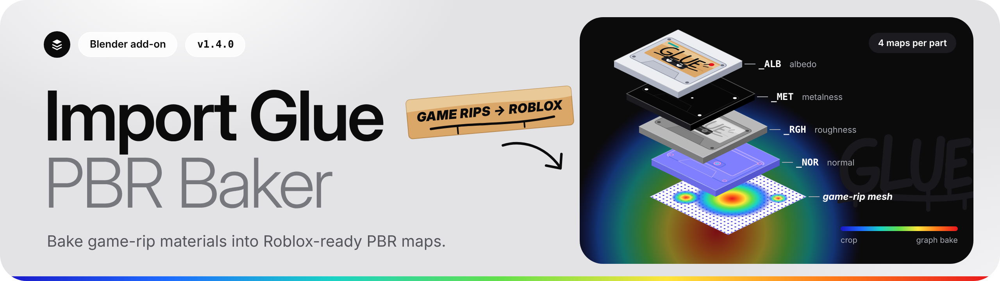

# Import Glue PBR Baker

A Blender add-on that converts game-rip meshes into Roblox-ready meshes and PBR texture maps.

Select the meshes you want, press **Run Import Glue**, and each part comes out with four PNG maps:

| Suffix | Map |
| --- | --- |
| `_ALB` | Albedo |
| `_MET` | Metalness |
| `_RGH` | Roughness |
| `_NOR` | Normal (OpenGL tangent-space) |

Your source objects, meshes, UVs, and materials are never edited. The add-on works on duplicates in a new output collection and writes a manifest and run log alongside the maps.

## What it does

- **Picks a route per part.** A part that already maps to one flat atlas with compact UVs is cropped straight from its textures. A part that needs repacking is baked through a proxy. Anything else, including complex shader graphs and meshes with no usable UVs, is baked with Cycles.
- **Checks textures first.** Missing or corrupt material textures are reported before any baking starts.
- **Respects the Roblox triangle limit.** Parts over the configured limit are decimated on the graph-bake route and rejected on the others, rather than exported silently.
- **Resumes safely.** Parts whose inputs and outputs are unchanged since the last run are carried over; anything that changed is baked again.
- **Runs headless.** A background launcher supports batch runs from the command line, with exit codes for scripting.

## New in 1.4.0

- **Material capability report.** Every material is rated SUPPORTED, APPROXIMATION REQUIRED or BLOCKED, with the reason and a next step. **Check Textures** shows a summary and writes `material_capabilities.json`.
- **Durable checkpoints.** Each finished part is saved as a hash-verified checkpoint, so a crashed or reopened session restores completed parts instead of baking them again.
- **Visual comparison report.** Off by default. **Save Visual Comparison** renders each converted part beside its source and saves the images with a PASS or FAIL verdict.

> **Changed from 1.3.0:** materials the four maps cannot carry are now refused by default. That includes any IOR other than 1.5, which is common in game rips. Tick **Allow Approximated Materials** under Advanced to bake them as 1.3.0 did; they are labelled `APPROXIMATED`.

## Download and install

1. Download the zip from the [latest release](https://github.com/emstauffer06/import_glue/releases/latest). Do not unzip it.
2. In Blender, open **Edit > Preferences > Add-ons**, choose **Install from Disk**, and select the zip.
3. Enable **Import Glue PBR Baker**.
4. In the 3D Viewport press **N**, open the **Roblox** tab, and use **Import Glue**.

Requires Blender 4.3 or newer. The current release was verified on Blender 5.2.0 (Windows) and 5.2.2 (Linux).

## Documentation

- **[Quick guide (PDF)](docs/import_glue_quick_guide.pdf):** a two-page visual walkthrough of installing the add-on, running a bake, how routes are chosen, and common fixes.
- **[User guide](docs/USER_GUIDE.md):** the full manual, including the capability report, checkpoints and the visual check.
- **[Release notes for 1.4.0](docs/RELEASE_NOTES_1.4.0.md):** everything that changed since 1.3.0, and known limits.
- **[Add-on README](import_glue_pbr_baker/README.md):** resolution settings, safety behavior, copy finalization, headless flags, and known engine limits.

## License

[GPL-3.0-or-later](LICENSE)
